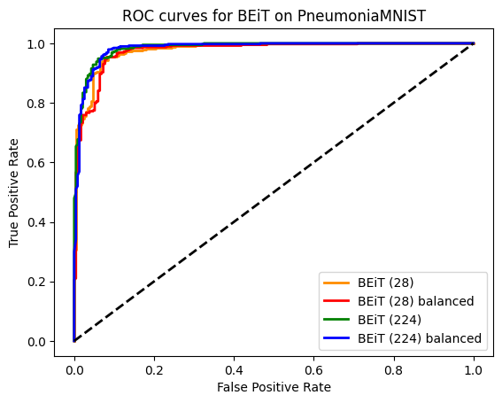

# Self-supervised Transfer Learning for Medical Image Classification

This project explores **self-supervised predictive learning** for medical image classification using the **BEiT (Bidirectional Encoder representation from Image Transformers)** model. We fine-tune a pre-trained BEiT model (trained on ImageNet) on two datasets from the [MedMNIST library](https://medmnist.com): **BreastMNIST** and **PneumoniaMNIST**.  

Our results show that BEiT achieves **strong generalization** on medical imaging tasks, outperforming several supervised baselines even under domain shift.

---

## 📌 Approach
- Fine-tuning **BEiT** on medical datasets.
- Comparison against supervised baselines (ResNet-18, ResNet-50, AutoML frameworks).
- Evaluation with standard metrics (**AUC**, **Accuracy**).
- Support for input resolutions **28×28** and **224×224**.
- Experiments with **class balancing** strategies.

---

## 📚 Datasets
We use two datasets from **MedMNIST v2**:
- **BreastMNIST** – Ultrasound images for binary classification (benign/normal vs malignant).  
- **PneumoniaMNIST** – Pediatric chest X-rays for binary classification (normal vs pneumonia).  

Both are preprocessed via Hugging Face to fit BEiT’s input requirements.

---

## 📊 Results (Highlights)
- **BreastMNIST**: BEiT outperformed ResNet and AutoML baselines, achieving AUC ≈ 0.91.  
- **PneumoniaMNIST**: BEiT achieved AUC ≈ 0.98, close to Google AutoML Vision.  

<p align="center">
  
  
</p>


Full experimental details are in the [report](./docs/Report.pdf).

---

## 🧭 Roadmap / Future Work
- Extend to more MedMNIST datasets.  
- Explore hybrid approaches (predictive + contrastive SSL).  
- Add interpretability tools (e.g., Grad-CAM, attention map visualizations).  

---

## 📖 References
- [BEiT: BERT Pre-Training of Image Transformers (Bao et al., 2021)](https://arxiv.org/abs/2106.08254)  
- [MedMNIST v2: A Lightweight Benchmark for Biomedical Image Classification (Yang et al., 2023)](https://arxiv.org/abs/2110.14795)

---

## 🚀 Deployment & API Usage

To ensure reliable and isolated execution, the inference API is containerized using **Docker**. The backend is built with **FastAPI**, which handles incoming image requests, routes it to the appropriate fine-tuned models, and returns the classification results.

The provided `Dockerfile` is optimized for CPU inference to ensure maximum compatibility out-of-the-box.

### 1. Build the Docker Image
Before building the image, execute `src/training.py` and ensure that the trained models are saved locally in the `models/` directory as expected by the Dockerfile.

To build the Docker image, run the following command in the root of the repository:

```bash
docker build -t medmnist-api .
```

### 2. Run the Container
Once the image is built, spin up the container and map it to port 8000 on your host machine:

```bash
docker run -d -p 8000:8000 --name medmnist-container medmnist-api
```

The API is now live and listening for requests at `http://localhost:8000`. You can also visit `http://localhost:8000/docs` in your browser to interact with FastAPI's auto-generated Swagger UI.

### 3. Make a Prediction
The API exposes a `/predict` endpoint that accepts POST requests. It requires two form data inputs:
* **task**: The model you want to use (either `"breast"` or `"pneumonia"`).
* **file**: The image file you want to classify.

You can test the endpoint using `curl`. Here is an example of how to classify an image for pneumonia:

```bash
curl -X POST "http://localhost:8000/predict" \
     -H "accept: application/json" \
     -H "Content-Type: multipart/form-data" \
     -F "task=pneumonia" \
     -F "file=@path/to/your/test_image.png"
```

**Expected JSON Response:**
The API processes the image and returns the predicted class, the model's confidence, and the raw probability distribution.

```json
{
  "task": "pneumonia",
  "predicted_class": "Positive",
  "confidence": 0.9876,
  "probabilities": [0.0124, 0.9876]
}
```

> **Note:** To stop and remove the container later, run `docker stop medmnist-container && docker rm medmnist-container`.
