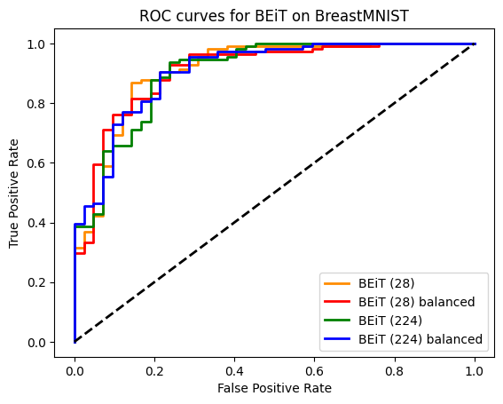

# Self-supervised Transfer Learning for Medical Image Classification

This project explores **self-supervised predictive learning** for medical image classification using the **BEiT (Bidirectional Encoder representation from Image Transformers)** model. We fine-tune a pre-trained BEiT model (trained on ImageNet) on two datasets from the [MedMNIST library](https://medmnist.com): **BreastMNIST** and **PneumoniaMNIST**.  

Our results show that BEiT achieves **strong generalization** on medical imaging tasks, outperforming several supervised baselines even under domain shift.

---

## 📌 Approach
- Fine-tuning **BEiT** on medical datasets.
- Comparison against supervised baselines (ResNet-18, ResNet-50, AutoML frameworks).
- Evaluation with standard metrics (**AUC**, **Accuracy**).
- Support for input resolutions **28×28** and **224×224**.
- Experiments with **class balancing** strategies.

---

## 📚 Datasets
We use two datasets from **MedMNIST v2**:
- **BreastMNIST** – Ultrasound images for binary classification (benign/normal vs malignant).  
- **PneumoniaMNIST** – Pediatric chest X-rays for binary classification (normal vs pneumonia).  

Both are preprocessed via Hugging Face to fit BEiT’s input requirements.

---

## 📊 Results (Highlights)
- **BreastMNIST**: BEiT outperformed ResNet and AutoML baselines, achieving AUC ≈ 0.91.  
- **PneumoniaMNIST**: BEiT achieved AUC ≈ 0.98, close to Google AutoML Vision.  

  
   

Full experimental details are in the [report](./docs/Report.pdf).

---

## 🧭 Roadmap / Future Work
- Extend to more MedMNIST datasets.  
- Explore hybrid approaches (predictive + contrastive SSL).  
- Add interpretability tools (e.g., Grad-CAM, attention map visualizations).  

---

## 📖 References
- [BEiT: BERT Pre-Training of Image Transformers (Bao et al., 2021)](https://arxiv.org/abs/2106.08254)  
- [MedMNIST v2: A Lightweight Benchmark for Biomedical Image Classification (Yang et al., 2023)](https://arxiv.org/abs/2110.14795)  
